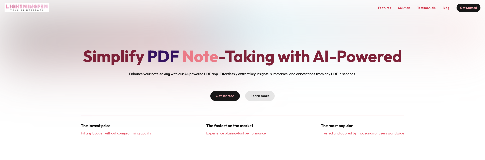
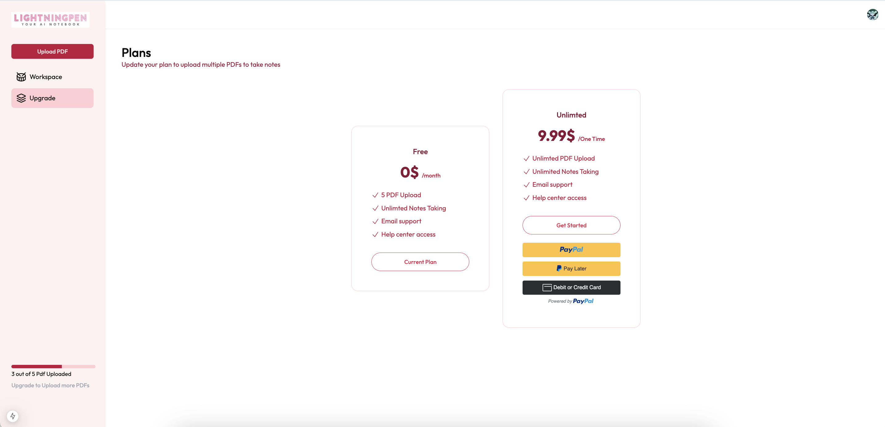
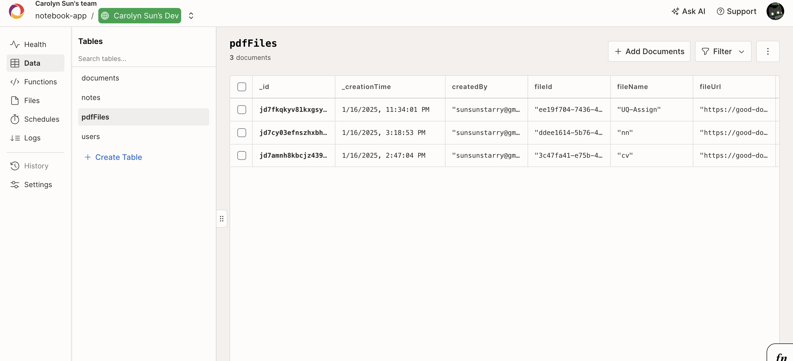

# AI Note-Taking App Using React, Tailwind CSS, and LangChain | SaaS App

Build a powerful AI-powered PDF note-taking app from scratch! This guide outlines the steps to create a modern SaaS app using Next.js, Tailwind CSS, LangChain, and advanced AI capabilities.


##Features
- Authentication: Social and email/password authentication using Clerk.

- Payment: Upgrade services through PayPal API as the development tool.


  
- Real-Time Database: Seamlessly store and manage user data with Convex DB.

## Tech Stack
- Frontend: Next.js, React, Tailwind CSS
- Authentication: Clerk
- Backend: Convex DB
- AI Integration: LangChain, Gemini API
- Hosting: Vercel

## Overview
Build a powerful AI-powered PDF note-taking app from scratch! This guide outlines the steps to create a modern SaaS app 
using Next.js, Tailwind CSS, LangChain, and advanced AI capabilities.
![Homepage]](./file/homepage.png)
## Features
- Authentication: Social and email/password authentication using Clerk.


![Payment]](./file/payment.png)
- Payment: Upgrade services through PayPal API as the development tool.


This is a [Next.js](https://nextjs.org) project bootstrapped with [`create-next-app`](https://github.com/vercel/next.js/tree/canary/packages/create-next-app).
>>>>>>> Stashed changes

## Getting Started

First, run the development server:

```bash
npm run dev
# or
yarn dev
# or
pnpm dev
# or
bun dev
```

Open [http://localhost:3000](http://localhost:3000) with your browser to see the result.

## Features
- Next.js React App: Modern and efficient React framework for building applications.
- Authentication: Social and email/password authentication using Clerk.
- Real-Time Database: Seamlessly store and manage user data with Convex DB.
- Tailwind CSS: Learn and apply Tailwind CSS for responsive and elegant UI designs.
- Dashboard Layout: Create an intuitive dashboard to manage user interactions.
- Upload PDFs: Enable users to upload PDFs for AI-powered analysis.
- LangChain Integration: Leverage LangChain for:
- Text Splitting
- Embedding
- Vector Storage
- Gemini API: Integrate AI modal capabilities for enhanced AI interactions.
- Text Editor: Build a custom text editor for seamless note-taking.
- Vector Search: Implement query-based vector search for AI-driven results.


## Learn More

To learn more about Next.js, take a look at the following resources:

- [Next.js Documentation](https://nextjs.org/docs) - learn about Next.js features and API.
- [Learn Next.js](https://nextjs.org/learn) - an interactive Next.js tutorial.

You can check out [the Next.js GitHub repository](https://github.com/vercel/next.js) - your feedback and contributions are welcome!

## Deploy on Vercel

The easiest way to deploy your Next.js app is to use the [Vercel Platform](https://vercel.com/new?utm_medium=default-template&filter=next.js&utm_source=create-next-app&utm_campaign=create-next-app-readme) from the creators of Next.js.

Check out our [Next.js deployment documentation](https://nextjs.org/docs/app/building-your-application/deploying) for more details.
